# Objective_Detection

### Goals / steps:

* Perform a Histogram of Oriented Gradients (HOG) feature extraction on a labeled training set of images and train a classifier Linear SVM classifier.

* Optionally, you can also apply a color transform and append binned color features, as well as histograms of color, to your HOG feature vector.
* Normalize features and randomize a selection for training and testing.
* Implement a sliding-window technique and use your trained classifier to search for vehicles in images.
* Run pipeline on a video stream and create a heat map of recurring detections frame by frame to reject outliers and follow detected vehicles.
* Estimate a bounding box for vehicles detected.

### Histogram of Oriented Gradients (HOG)

As a first step, read all vehicle and non-vehicle images, for example:

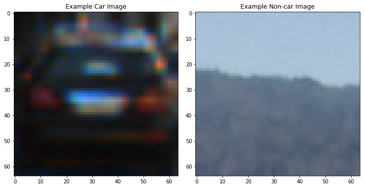

Then explore different color spaces and different HOG parameters. Below shows an example of using parameters of `color_space = 'YCrCb'`, `spatial_size = (32, 32)`, `hist_bins = 32` , `orient = 9`, `pix_per_cell = 8`, `cell_per_block = 2`:

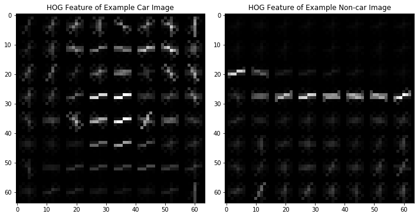

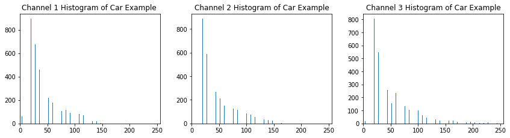

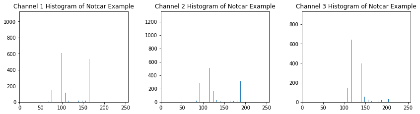

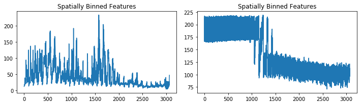

### Training

A linear SVM is trained in code “3. Train Classifier”. Provided training images from “vehicles” and “non-vehicles” are used to generate HOG, color histogram and spatial binned features. All samples are normalized and split in two training group and test group.

### Sliding Window Search

Four scales, scale = [1, 1.5, 2, 2.5], are used to do sliding window. Larger window has lower scanning bound. Overlap is set to 2 steps.

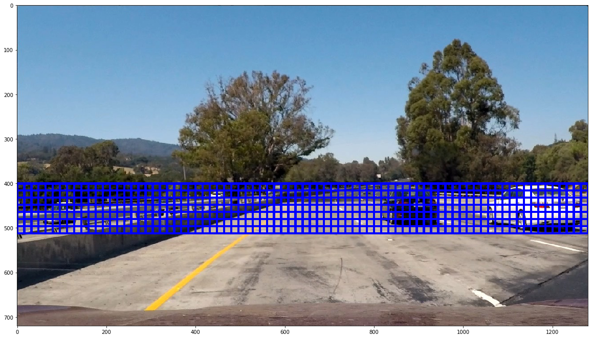

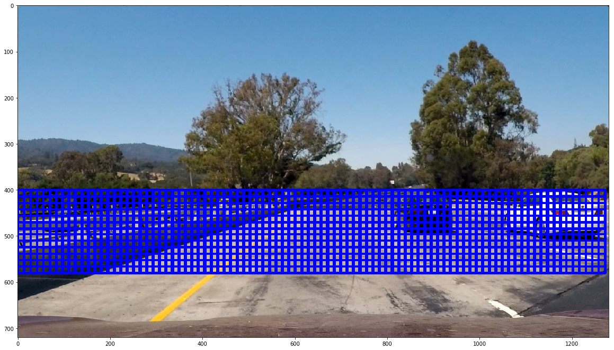

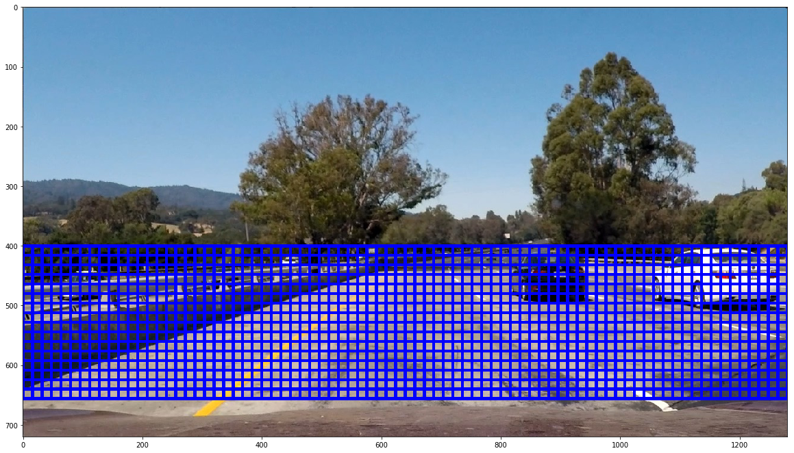

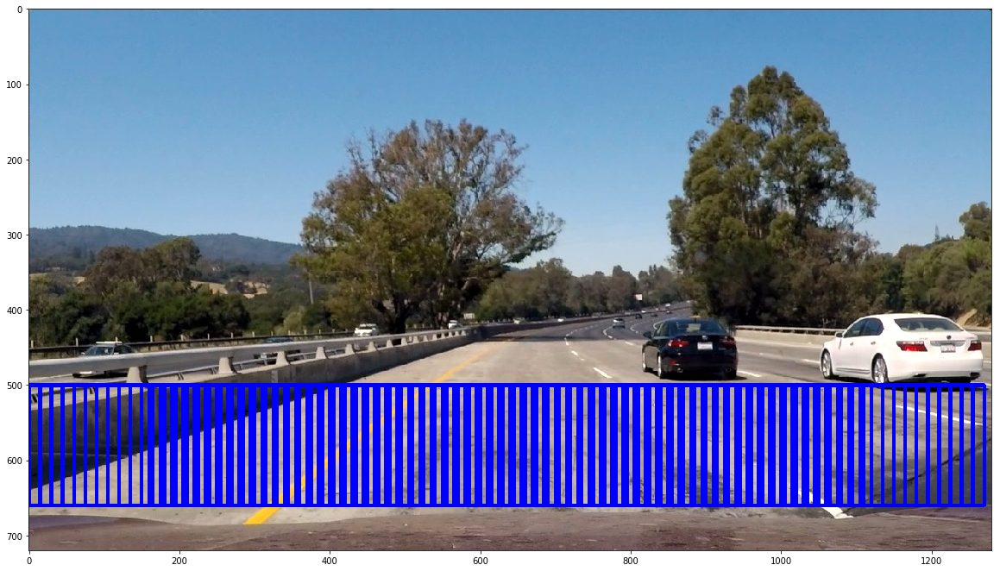

`Ycrcb` HOG features, spatially binned color and color histograms are combined to provide good results.

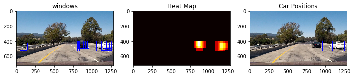

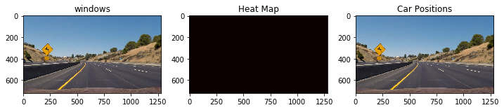

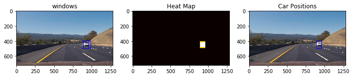

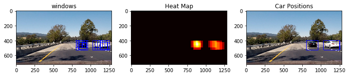

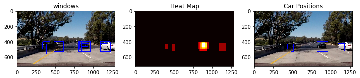

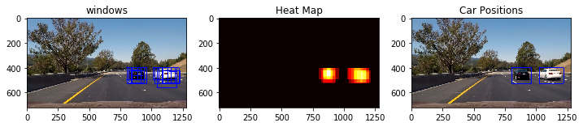

### Resulting videos

`project_video_out.mp4` and `test_video_out2.mp4`.